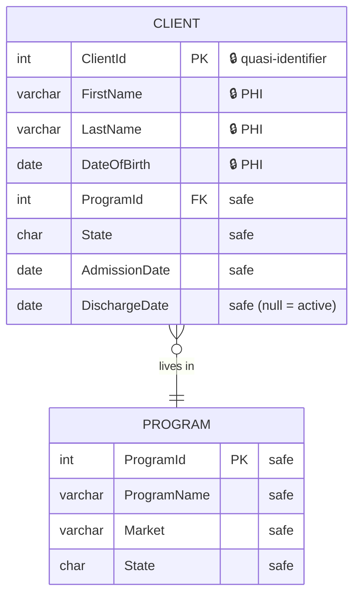
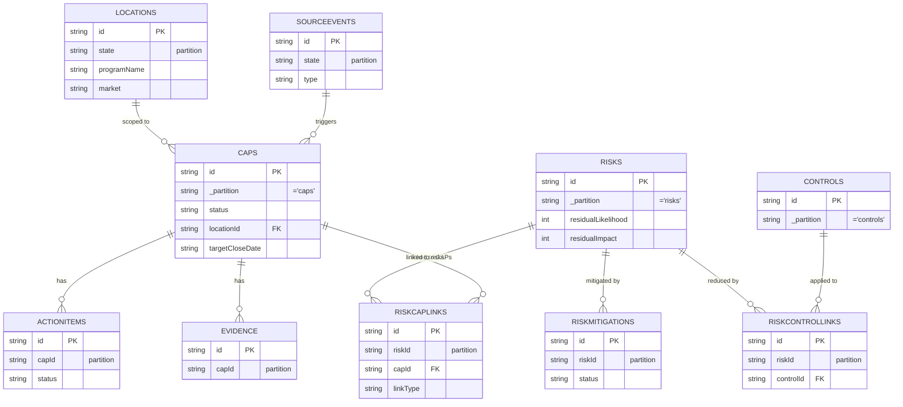

# Beacon Care Intelligence — Data Model (ERD)

Entity-relationship reference for BCI's data. Three domains:

1. **BCI's own Cosmos** (`care-intelligence`) — read/write, **PHI-free**.
2. **c360 (Fabric `core-prod-db`)** — read-only source, **PHI**. Illustrative
   until the real dump lands (see `scripts/dump-c360-schema.mjs`).
3. **cap app Cosmos (`capapp`)** — read-only source (CAPs/Risks/Audits/Locations).

> Diagrams are Mermaid `erDiagram`. PHI never crosses into the BCI Cosmos domain
> (§2 of [C360_INTELLIGENCE_PLAN.md](C360_INTELLIGENCE_PLAN.md)) — the only flow
> from c360 into Cosmos is **de-identified aggregates / metadata**.

---

## 1. BCI own Cosmos — `care-intelligence` (PHI-free, read/write)

```mermaid
erDiagram
    USERS ||--o{ REPORTS       : "creates"
    USERS ||--o{ CHATSESSIONS  : "owns"
    USERS ||--o{ AITURNS       : "generates"
    USERS ||--|| AIBUDGETS     : "has"
    USERS ||--o{ ACCESSLOG     : "PHI views audited in"
    CHATSESSIONS ||--o{ AITURNS : "contains"
    C360SCHEMA ||--o{ C360SNAPSHOTS : "describes grain of"
    C360SCHEMA ||--o{ C360VECTORS   : "embeds non-PHI parts of"
    REPORTS ||--o{ INSIGHTS    : "annotated by"

    USERS {
        string id PK "Entra OID"
        string pk "= 'users'"
        string email
        array  roles "system role names"
        array  permissions "direct grants"
        object clientScope "'*' | { programIds[], states[] } — gates client PII"
        bool   provisioned
    }
    REPORTS {
        string id PK
        string pk
        string template "monthly-summary | board-packet | ..."
        object scope "state/market/date filters"
        object content "generated sections"
        string createdBy FK "USERS.id"
        string createdAt
    }
    INSIGHTS {
        string id PK
        string pk
        string subjectRef "report/metric key"
        string summary "AI narrative (de-identified)"
        array  callouts
        string asOf
        int    ttl "1 day"
    }
    SIGNALS {
        string id PK
        string pk
        string kind "recidivism | aging | drift | ..."
        string scopeRef "program/market"
        number score
        string explanation "de-identified"
        string status "open | ack | dismissed"
    }
    CHATSESSIONS {
        string id PK
        string sessionId "partition key"
        string userOid FK "USERS.id"
        array  messages
        string startedAt
    }
    AITURNS {
        string id PK
        string userOid "partition key"
        string sessionId FK "CHATSESSIONS.sessionId"
        string prompt
        array  toolCalls "tool + args + result shape"
        int    tokens
        int    ttl "90 days"
    }
    AIBUDGETS {
        string id PK "= userOid"
        string pk
        int    turnsToday
        int    tokensToday
        string resetAt
    }
    ACCESSLOG {
        string id PK
        string pk "= 'accessLog'"
        string userOid FK "USERS.id"
        string action "view-client-pii"
        string clientId "audited id only — never the name"
        string outcome "granted | denied-scope | not-found"
        string at
    }
    C360SCHEMA {
        string id PK "c360-dict-v{N} | c360-dict-current"
        string pk "= 'c360Schema'"
        int    version
        array  tables "name/grain/phi + columns[classification,isIdentifier]"
        array  joins
        array  glossary
        array  metrics
    }
    C360SNAPSHOTS {
        string id PK "rollupKey-asOf"
        string pk
        string rollupKey "census_by_program | ..."
        array  rows "DE-IDENTIFIED aggregates, small cells suppressed"
        object grain
        string asOf
    }
    C360VECTORS {
        string id PK
        string pk
        string sourceKind "glossary | metric | schema | dei-summary (NON-PHI only)"
        string text
        array  embedding "vector"
    }
```

---

## 2. c360 source — Fabric `core-prod-db` (read-only, **PHI**) — *illustrative*

This mirrors `docs/c360-annotations.example.json`. **Replace with the real
structure** after running `scripts/dump-c360-schema.mjs` and authoring the
dictionary. PHI columns are flagged 🔒.



**De-identification boundary (C2):** only aggregates of the *safe* columns
(e.g. counts grouped by `ProgramId` / `State` / admission month) may be written
to `C360SNAPSHOTS`. 🔒 columns never leave the in-flight aggregation step; small
cells (< min N clients) are suppressed.

---

## 3. cap app source — Cosmos `capapp` (read-only)

The system-of-record care data BCI reports on. Partition keys in parens.



---

## Maintenance

- **§1** is authoritative — keep it in sync with `infra/main.bicep` `containers[]`
  and the function/lib code as the schema evolves.
- **§2** is a placeholder generated from the example annotations; regenerate it
  from the real dictionary once loaded.
- **§3** reflects the cap app's containers (see its `APPLICATION.md`); update if
  the cap app's schema changes in a way BCI depends on.
```
